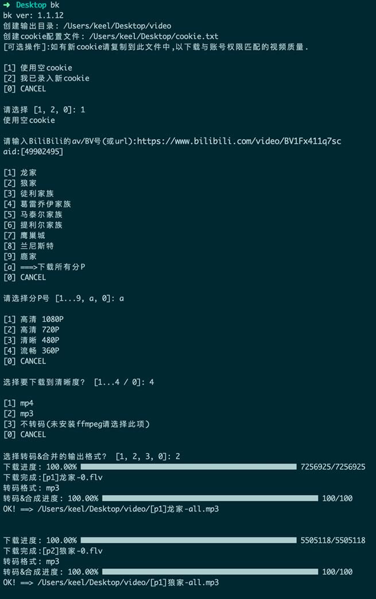

# bk
* 下载B站(Bilibili)视频,功能如下:
  1. 视频下载并合并;
  2. 分P检测及下载;
  3. 视频质量选择;
  4. 一次下载所有分P(如某一P没有指定质量,则按最高质量);
  5. 视频转码(支持mp4/mp3),可选择格式
* 下载youtube(需要youtube-dl)

## 安装
1. 安装nodejs (https://nodejs.org), 选择LTS版本;
2. 命令行(CMD)进行全局安装,执行:
  ```
  npm i -g bk
  ```
3. [可选]安装ffmpeg (http://ffmpeg.org/download.html) 以支持转码与合并, 选择对应系统版本安装(也可自行搜索"ffmpegp安装"查找方法);

## 运行
### 下载B站视频:
1. 命令行运行以下命令,然后根据提示选择操作:
  ```
  bk
  ```
2. [可选]获取B站cookie(具体操作参考最下方)并按提示进行配置,可支持对应账号的视频质量,如不配置也可以(不保证有最高质量选择),注意老cookie会失败,需要更新;
3. 处理好的视频可以命令执行当前目录下的video目录下找到;
4. 样例:


### 下载youtube视频:
1. 安装youtube-dl
  ```
  npm i -g youtube-dl
  ```
2. 命令行运行
  ```
  bk y
  ```

-----
## 注意的问题
* 运行时先配置cookie;
* ffmpeg如果未安装则转码会失败,但原视频有合适的播放器是可以播放的;

## 用到的接口
```
https://api.bilibili.com/x/player/playurl?avid=${avid}&cid=${cid}&qn={qn}&otype=json
https://api.bilibili.com/x/web-interface/view?aid=${avid}
```

## 如何获取B站cookie
1. 使用B站账号登录,推荐使用谷歌浏览器(chrome);
2. 访问任意一个视频详情页;
3. 打开"开发者工具"(右上角3个点的选项>更多工具>开发者工具);
4. 在开发者工具最上方选择"Network"标签;
5. 刷新这个页面,则会看到很多的网络请求;
6. 点击其中的第1个或第2个请求,右边看到"Request Headers"的部分,如果其中有"cookie:",且它的值中包含"_uuid=.....;",就是需要的cookie;
7. 如果请求刷得比较多,再次刷新选择第1个即可,注意它的"Request URL"必须有  "www.bilibili.com" 或 "api.bilibili.com".
8. cookie配置后将具备与此账号相同的权限(如大会员权限),不配置cookie则是普通权限,仅对下载视频质量的选择有影响;
